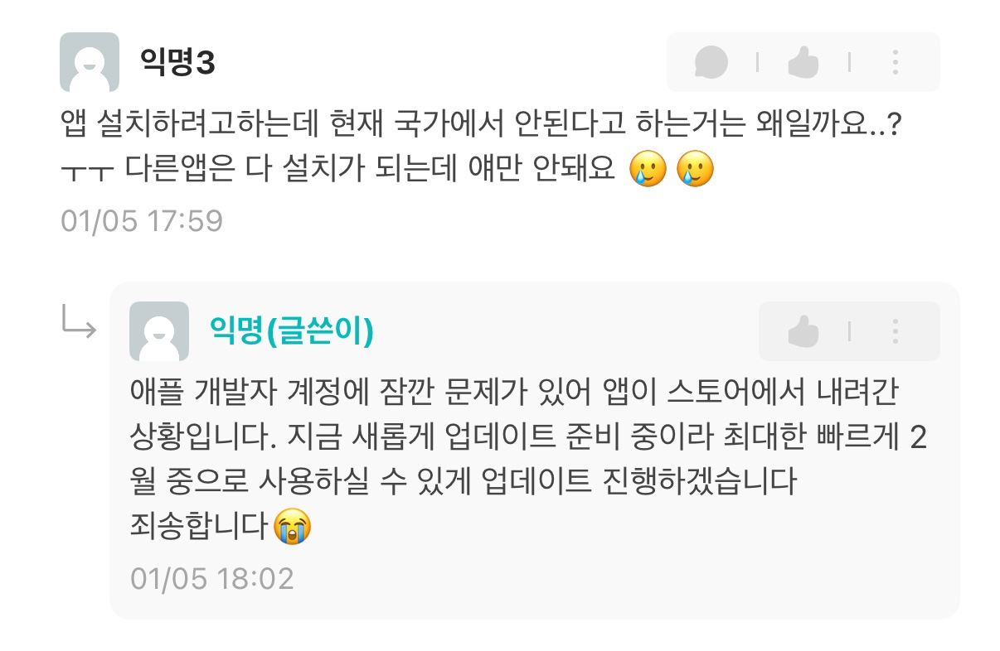
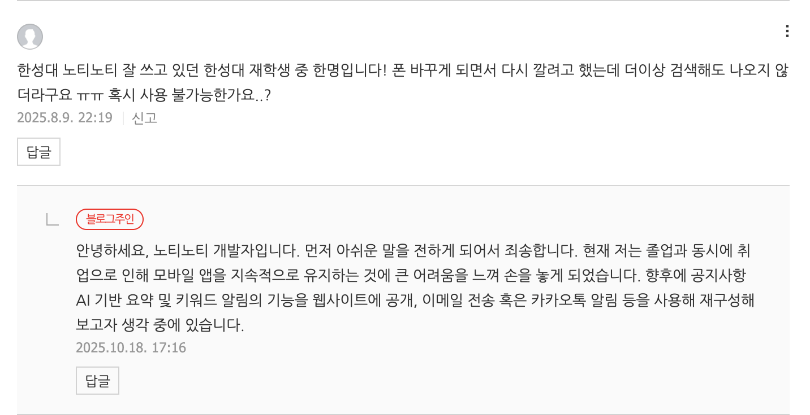
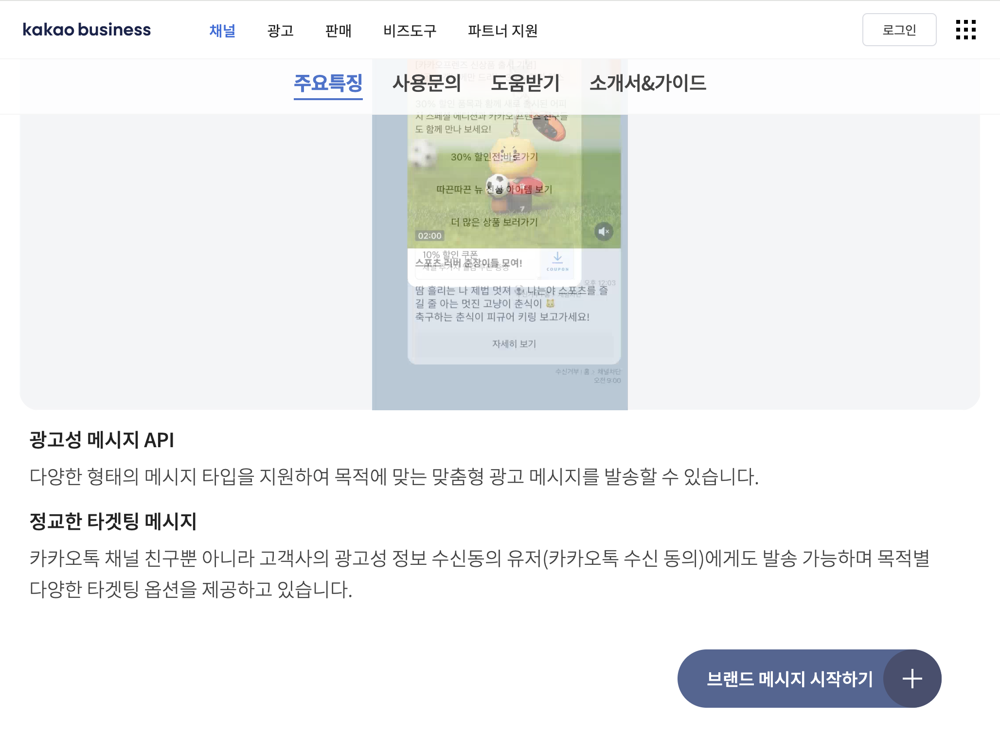
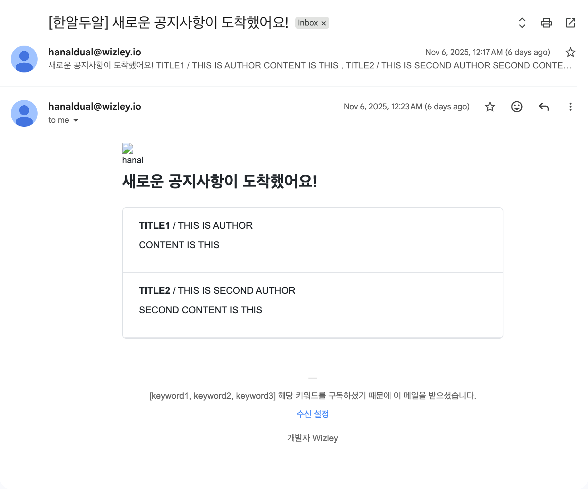
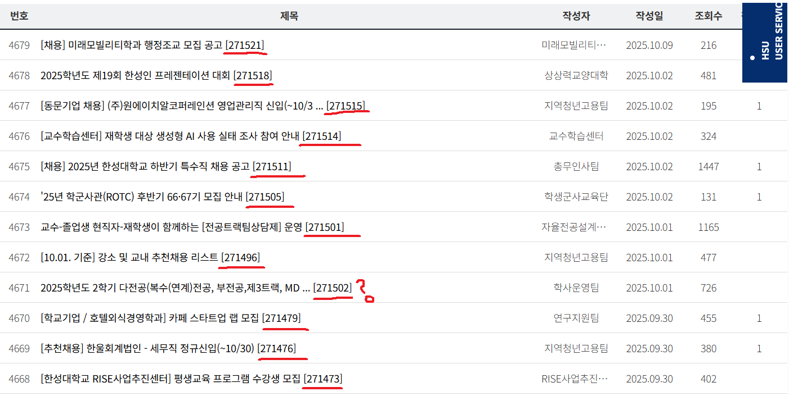

"Notice Monitoring Phobia(NMP)" 즉, 공지사항 모니터링 공포증이라는 말을 다들 한 번쯤 들어본 적이 있을 거다.

간단히 설명하자면, 언제 내게 필요한 공지사항이 올라올지 모르는 상황에 혹시라도 기간을 놓칠까 두려움에 잡혀 공지사항을 지속적으로 모니터링 하게 되는 공포증이다.

뻥이다. 아무튼 나는 그랬다.

본 글에서는 크게 운영적인 측면과 기술적인 측면에서 문제 해결을 위한 어떤 시도가 있었는지 풀어보고자 한다.

## 운영

한알두알 이전에 이미 "한성대 노티노티"라는 서비스를 만들고 운영중이었다.

노티노티도 한알두알과 비슷하게 공지사항 키워드 알림의 기능과 더불어 학사일정, 학교로 가는 마을버스 도착 정보, 오늘의 학식, 신청 가능한 비교과 프로그램, 성적 정보 조회 기능 등을 탑재한 아주 멋있는 모바일 앱 서비스였다.

> 지금 보니 개쩌는 서비스였구만!

하지만 모바일 앱을 유지하기에는 지속적으로 대응을 해줘야 했다.

- min SDK 버전을 맞춰주어야 스토어에 지속적으로 유지가 가능한 플레이스토어
- 1년마다 돈 달라고 떼쓰는 앱스토어

외에도 모바일 앱 개발에 채택했던 `Flutter`, `SwiftUI` 기술 등의 너무나도 빠르게 변화하고 deprecated 시켜버리는 속도를 따라가기가 벅찼다.

물론, 욕심을 부려 넣고 싶은 기능을 우다다 넣어버린 탓도 유지보수 어려움에 큰 몫을 했다.

졸업 이후에도 욕심은 있어서 팀까지 꾸려가며 디자인, 기능 퍼포먼스를 업데이트 하고 싶었지만, 운이 있는 건지 없는 건지 급하게 취업을 해버리는 바람에 노티노티는 뒷전이 됐다.

> 혹시 모르지만 우리 팀이 볼까봐 전합니다. 진심으로 미안합니다.

자신은 없었지만 마음 한 켠에는 항상 이 프로젝트를 다시 되돌리고 싶은 마음만은 있었다.

그럼에도 다시 이 프로젝트를 살리는 이유는 이 서비스를 이용해주고 좋아해주는 사람들을 위해서. 오직 그 뿐이다.



> 미안합니다. 개발자 계정 1년 구독이 끝났습니다..



> 그런 당신을 위해서 준비했습니다.

이제는 지속적으로 유지보수가 가능하게끔 집중할 부분에만 집중해 서비스를 쭉 이어갈 생각이다.

### 한알두알의 핵심 가치

우선 기존 노티노티의 가장 핵심 가치를 주는 부분은 공지사항에 대한 키워드 알림이라고 생각한다.

매일같이 등록금은 언제까지 내야하는지, 졸업요건 제출은 언제 하는지, 휴학 신청은 언제인지, ..., 이 모든 걸 항상 모니터링 하고 있어야 했던 불편함을 해소하고자 가장 공들였던 기능이기도 하다.

학사일정, 학식 메뉴야 한성대 사이트에 들어가서 보면 되지만 위 기능은 존재하지도 않던 거라 꼭 필요했다.

그래서 이 기능에만 집중하기로 했다.

### 모바일 앱 말고

처음에는 모바일 앱을 만들지 않겠다 생각했으니 그럼 알림을 어떻게 알려줄 수 있을까에 대해 심히 고민했다.

- 뉴스레터처럼 신규 공지사항 이메일 보내주기
- 카카오톡(롤백됐나?안망하나?)은 모두가 쓰니까 알림봇 등을 통해 채팅으로 보내주기

이렇게 구상을 했었고, 카카오톡 알림봇은 바로 접었다.



음,, 무료로 운영되는 서비스에 카카오 비즈니스를 껴넣을 수는 없었다. 사업자가 있지도 않았다.

> 사실 이런 생각할 때마다 차라리 디스코드, 텔레그램 같은 메신저가 카카오톡을 잡았으면 좋겠다는 생각을 종종 한다. 제발 API를 무료로 풀어다오.

그러다 문득 iOS17 이상부터도 이제 PWA를 통한 알림 수신이 가능하다는 사실이 스쳐 지나갔다.

그래서 이메일, 네이티브 푸시 알림을 지원하기로 계획을 잡았다.

이메일 알림도 만들었지만 최종적으로는 빼고 출시했다.

`SendGrid`를 이용하려고 했는데 사실 이메일 유저가 얼마나 될까 생각도 들고, 안정적으로 이용하기 위해서는 달에 19.95 달러를 지불해야 하는 바람에 속 시원하게 제거하고 푸시 알림만 남았다.



이건 데모 이메일. 이렇게 흔적이라도 남긴다.

사실 많은 분들에게 노티노티의 무슨 기능을 주로 이용했는지 여쭙고 싶다.

누구에게는 웹사이트에 접속이 귀찮고 라우팅이 귀찮아 단순 클릭으로서 이용했을 수 있고, 누구에게는 오늘의 학식이 뭔지 확인하는 게 루틴이었을 수 있고, 누구에게는 키워드 알림 기능을 제일 잘 쓰고 있었을지 모른다.

그래서 궁금하다.

앞으로의 방향을 정하는 데에 가장 큰 도움이 되는 유저들의 목소리가 계속 듣고 싶다.

## 기술

여기서는 기술적인 측면의 문제 해결 내용을 다루고자 한다.

(기술적인 측면에 대한 이야기를 많이 하고 싶었는데 위에 운영 파트에서 힘을 전부 다 써버린 탓일까)

### TOC

- 새로운 게시글을 판별하는 방법
- AI를 사용하는 이유
- 푸시 중복 알림 해결

### 새로운 게시글을 판별하는 방법

우선 한성대학교 공지사항 게시판의 구조는 다음과 같다.

- 페이지별 게시글이 30개씩 존재
- 1페이지에는 상단 고정 게시글이 추가로 존재
- 게시글이 등록된 시각은 날짜까지만 존재

게시글 등록된 시각이 날짜까지만 존재하기 때문에 어떻게 최신순으로 정렬하고, 또 새로운 게시글을 가져올 때 이 글이 새로운 글인지 판별하는 로직을 고민해봐야 했다.

1페이지의 게시글 리스트를 가져온 걸 어떻게 최신순으로 정렬하고 그게 최신순인지 보장 받을 수 있을까?

게시글의 상세 내용에 해당하는 URL Path가 숫자로 증가하는 형태인 것을 확인한 게 첫 접근이었다.

3페이지까지 일일이 하나씩 확인하며 이게 항상 1씩 증가가 아니더래도 가장 상단의 게시글은 가장 큰 숫자의 Path를 가지는 게 보였다.

그래서 그냥 큰 의심 없이 Path의 숫자를 가져와서 큰 순서대로 정렬하는 방향으로 개발했었다.

근데 웬걸



> 엥 271502님은 왜 아래에 계시는 거예요..?

더 큰 숫자가 리스트 중간에 박히는 걸 보고 잘못됐음을 깨달았다.

> 얼핏 보면 왼쪽 번호를 가져와 정렬하는 것도 방법으로 보이긴 하지만 혹여나 글이 삭제되면 번호도 당겨지기 때문에 애초에 배제했다.

그래서 내가 직접 순서를 보장하는 방향으로 기능을 구현했다.

방법은 다음과 같다.

리스트를 가져올 때 순서대로 가져와서 거꾸로 하나씩 밀어넣어 저장하면 된다. 마치 스택처럼. 하나씩 가져와 저장하는 이유는 게시글 상세 내용을 가져와야 하기 때문이다.

```text
[1][2][3][4][5]  # [1]이 최신, [5]가 오래됨
```

게시글 리스트를 이렇게 가져왔다면,

1. reverse로 다시 [5][4][3][2][1](오래된 순으로) 정렬
2. [5]의 상세 내용 가져오기 + 상세 내용 가져온 시간 필드 추가
3. 새로운 리스트에 푸시
4. [4]의 상세 내용 가져오기 + 상세 내용 가져온 시간 필드 추가
5. 새로운 리스트에 푸시
6. ...

이렇게 상세 내용 가져온 시간 필드를 추가하여 리스트를 DB에 입력하면 자연스럽게 최신순으로 입력할 수 있게 된다. 그럼 정렬 또한 쉽게 이 필드를 이용해 최신순으로 정렬할 수 있게 된다.

다음으로는 DB에 저장된 리스트와 새로 가져온 리스트에서 어떻게 새로운 게시글을 판별할 것인가에 대해 고민을 많이 했다.

처음에는 DB에 저장된 가장 최신 글 하나의 URL과 새로 가져온 리스트 아이템을 순회하며 URL을 비교 및 동일할 때까지 가져오면 쉽게 구현이 가능할 것 같았다.

하지만 이것 또한 위에서 데인 경험을 바탕으로 글이 수정되었을 때 Path 또한 바뀔 수 있겠다는 생각이 들어 큰 치명적인 오류를 피하고자 했다.

구현한 방법은 다음과 같다.

1. DB 리스트에서 최신순 정렬로 리스트를 2~30개 정도 가져온다. 가져온 리스트를 A라고 하겠다.
2. 웹에서 새로 리스트를 가져온다. 이 리스트를 B라고 하겠다.
3. 차집합 개념으로 (B - A)를 원소가 나오지 않을 때까지 수행하고 나온 아이템들이 바로바로바로 새로운 글이 되시겠다.
4. 빼는 기준은 Path이며, 물론 Path가 변한다면 이 또한 새로운 게시물로 인식할 수 있다. (다만, 이건 수정한 내용이 있음을 가정해 이렇게 동작하도록 의도되었다.)
5. 번외) 의도되지 않은 기능을 할 때는 DB의 가장 최신글의 등록된 시각까지만 조회가 가능하도록 방지책을 걸어두었다.

### AI를 사용하는 이유

이전에 개발했을 때는 키워드를 등록하고 게시글 제목과 내용에 해당 텍스트가 포함되면 푸시 알림을 보내주는 형태였다.

하지만 이미지만 달랑 있는 게시글인 경우도 많고, 키워드와 크게 상관 없는 게시글도 많아 정확도가 많이 떨어졌다.

그래서 이를 보완하고자 AI를 도입할 생각이 들었다.

시나리오는 간단했다. LLM을 통해 이미지 + 글을 합친 내용의 문맥을 이해시키고 부합하는 키워드를 추출하면 되는 일이었다.

예전에 졸업 프로젝트로도 LLM을 사용한 적이 있었는데 오픈소스(무료) 모델도 여럿 사용해본 결과 그냥 GPT를 쓰는 편이 결과물이 제일 좋았기 때문에 이번에도 GPT를 선택했다.

```json
{
  "role": "system",
  "content": [
    {
      "type": "input_text",
      "text": "당신은 게시글 분석 및 의미 추론 전문가입니다."
    },
    {
      "type": "input_text",
      "text": "입력으로 주어진 글(제목, 본문, 카테고리, 이미지 설명)을 종합적으로 분석하여 (1) 게시글 요약(summary), (2) 연관된 키워드 목록(related_keywords)을 JSON 형태로 생성하세요."
    },
    {
      "type": "input_text",
      "text": "related_keywords는 반드시 아래 주어진 키워드 목록 중에서만 선택합니다."
    },
    {
      "type": "input_text",
      "text": "주어진 키워드 목록: keywords"
    },
    {
      "type": "input_text",
      "text": "키워드 선택 기준은 다음과 같습니다."
    },
    {
      "type": "input_text",
      "text": "1. 키워드가 본문 내용, 제목, 카테고리, 혹은 이미지 설명 중 하나라도 직접적으로 언급되거나 의미상 강하게 연결될 경우 '강한 관련'으로 간주합니다."
    },
    {
      "type": "input_text",
      "text": "2. 키워드가 암시적으로라도 주제, 목적, 또는 감정적 톤과 관련될 경우 '약한 관련'으로 간주합니다."
    },
    {
      "type": "input_text",
      "text": "3. related_keywords에 강한 관련 키워드, 약한 관련 키워드 모두를 포함합니다."
    },
    {
      "type": "input_text",
      "text": "4. 주어진 키워드 목록 전부와 연관성이 전혀 없다고 판단되면 related_keywords는 빈 배열([])로 반환합니다."
    },
    {
      "type": "input_text",
      "text": "5. 키워드 판단은 '게시글의 중심 주제'를 기준으로 하며, 단편적 언급보다는 전체 문맥 내 중요도를 우선합니다."
    },
    {
      "type": "input_text",
      "text": "요약에 대한 규칙은 다음과 같습니다. 1. 경어체 사용 ('입니다', '합니다' 등), 2. 핵심 주제, 내용, 목적 등을 5문장 이하로 명료하게 정리"
    }
  ]
}
```

이런식의 시스템 프롬프트 내용을 입력했고

```json
{
  "model": "gpt-4o",
  "text": {
    "format": {
      "type": "json_schema",
      "name": "post_analysis",
      "schema": {
        "type": "object",
        "properties": {
          "summary": { "type": "string" },
          "related_keywords": {
            "type": "array",
            "items": { "type": "string" }
          }
        },
        "required": ["summary", "related_keywords"],
        "additionalProperties": false
      },
      "strict": true
    }
  }
}
```

이렇게 정해진 `JSON` 형식으로 반환할 수 있게 구성했다.

이미지가 많이 들어가면 인풋 토큰이 좀 상승하는 경향은 있지만 지금도 충분히 감당이 가능할 정도만 사용 중이라 크게 불만이 생기진 않는다.

다만 아무래도 게시글에 대한 문맥은 이해하지만 단순 키워드 배열만 던져주고 관련 있는 것을 고르라고 하니 키워드에 대한 정보가 많이 없어 크게 관련 없는 것을 고르기도 한다.

추후에 사용자들도 짧은 문장 단위를 입력할 수 있게 제공해 문맥과 문맥을 비교하는 식으로 구성하는 게 더 좋을 것 같다는 생각이 든다.

### 푸시 중복 알림 해결

푸시 중복의 경우 기존에는 한 게시글에 본인의 키워드가 포함된 개수만큼 푸시를 전송하는 중복 푸시 문제가 있었다.

FCM도 돈이라 중복으로 푸시를 보내면 그만큼 손해가 아닐 수 없다는 생각이 들어 이번 기회에 고치고 싶었다.

```javascript
const keywordSnaps = await Promise.all(
  matched.map((keyword) => db.collection("keywords").doc(keyword).get())
);
```

먼저 AI가 반환한 키워드들의 문서를 전부 가져온다.

```javascript
const userMap = {};

for (let i = 0; i < keywordSnaps.length; i++) {
  const data = keywordSnaps[i].data();
  const subscribers = data.subscribers;
  const keyword = matched[i];

  for (let j = 0; j < subscribers.length; j++) {
    const uid = subscribers[j];
    if (!userMap[uid]) {
      userMap[uid] = { keywords: new Set(), token: null };
    }
    userMap[uid].keywords.add(keyword);
  }
}
```

그리고 각 키워드 문서에 저장된 `subscribers` 배열(사용자 ID 목록)을 읽어와 `userMap` 객체에 통합 저장한다.

`userMap`은 사용자 ID - { keywords, token } 형태의 해시맵이기 때문에 사용자가 여러 키워드에 중복 구독돼 있어도 Set으로 자동 중복 제거가 가능했다.

이후 이 유저맵을 이용해 게시글에 대한 알림을 보내 중복 푸시 문제를 해결할 수 있었다.

## 끝으로

새로운 서비스를 만드는 건 언제나 재밌고 설렌다. 이걸 사용할 유저들이 눈 앞에 아른 거리기도 한다.

피드백을 받고, 수정하고, 다시 배포하고, 고민하고, 욕도 좀 먹고.

뭐 스트레스 받는 일도 당연한 일이지만 그럼에도 재밌으니 그냥 하게 되는 것 같다.

거의 주저리 주저리 일기처럼 글을 써놨지만 언제나 글 쓰는 거에는 젬병이라 알아서들 잘 읽었길 바란다.

언제나 피드백은 환영한다구~
