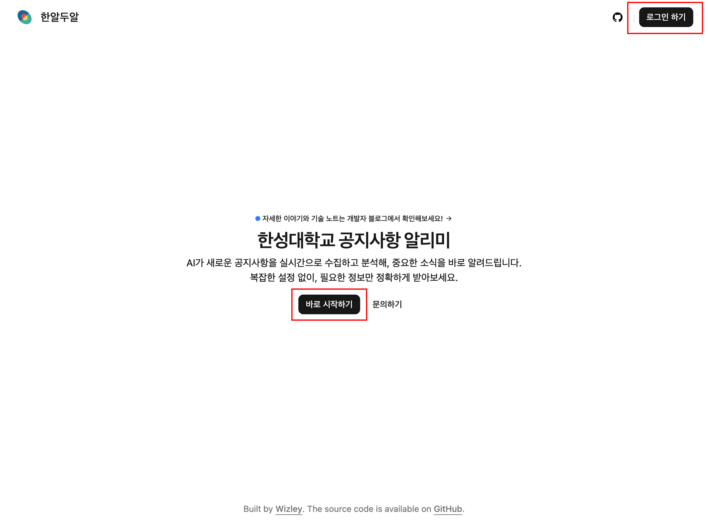
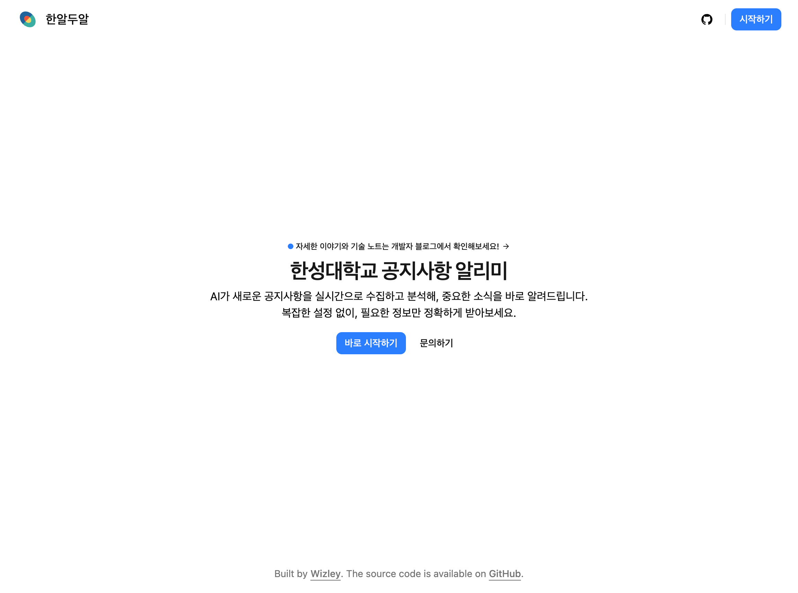
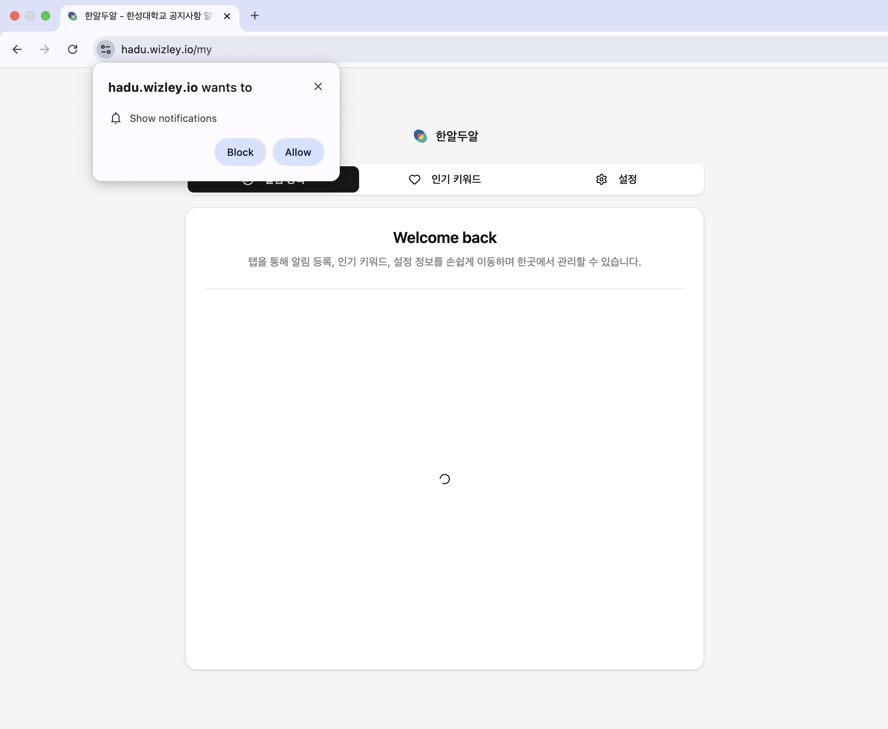
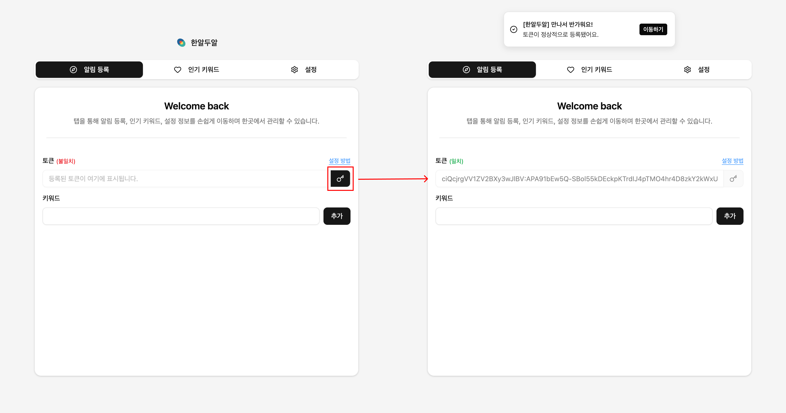
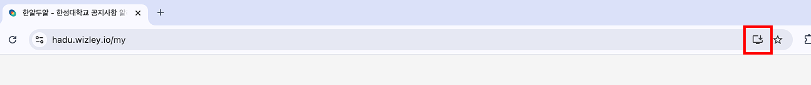
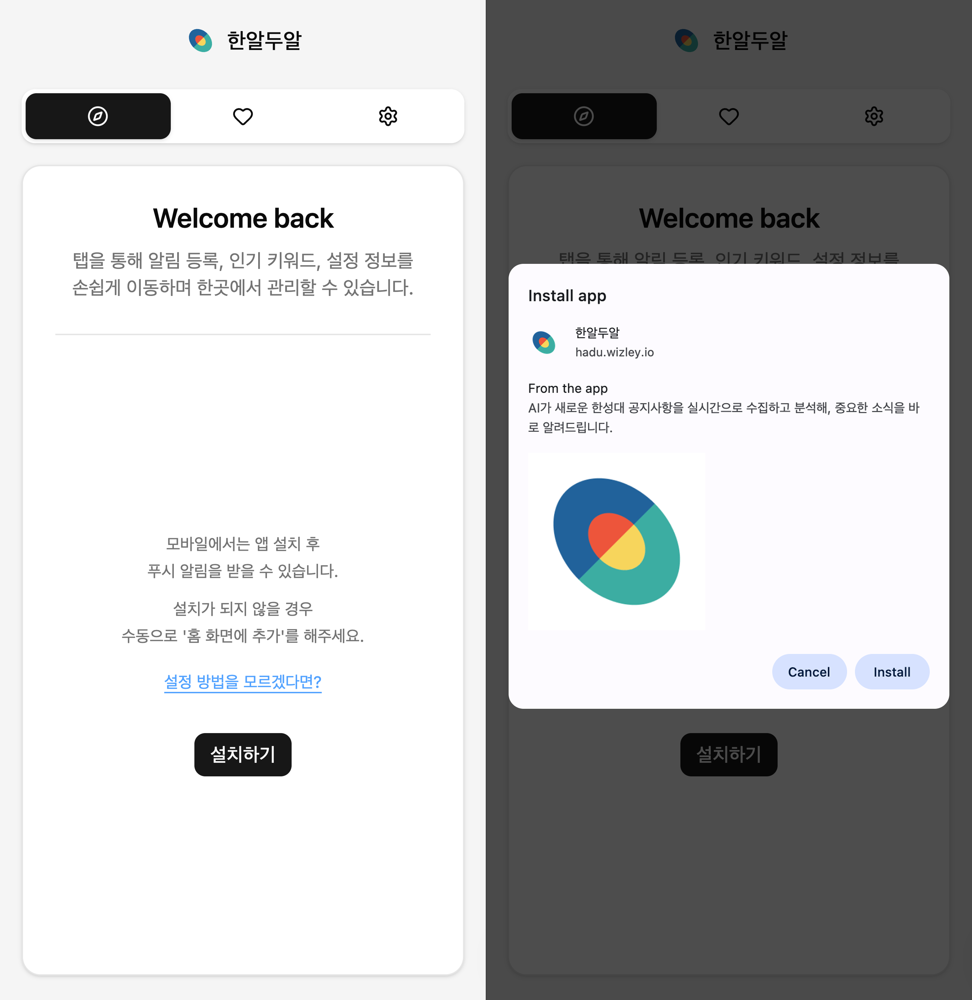
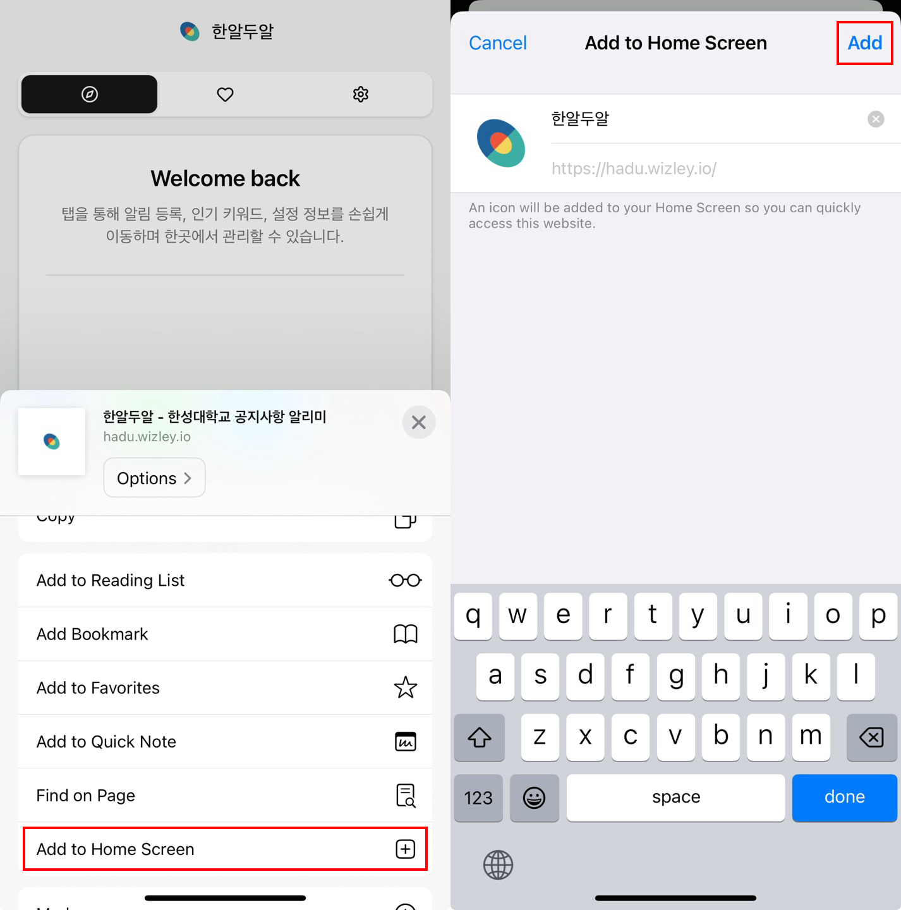

한알두알 사용법입니다. 간단합니다.

## 공통

[hadu.wizley.io](https://hadu.wizley.io/)로 접속합니다.

'바로 시작하기' 혹은 '로그인 하기' 버튼을 눌러 로그인을 진행합니다.

로그인에 성공하면 해당 버튼이 **파란색**으로 변하며, 다시 클릭하면 토큰, 키워드 등을 설정할 수 있는 **마이페이지**로 넘어갑니다.

## PC (웹 브라우저)

정상 이용을 위해서 알림 권한을 허용합니다. (허용하지 않으면 이용이 불가합니다.)

'열쇠' 버튼을 눌러 알림 수신에 필요한 토큰을 발급합니다.

초록색 글씨로 **일치**가 보이면 정상적으로 등록이 완료되었습니다.

자유롭게 키워드를 등록 후 이용할 수 있습니다.

### Option

브라우저 지원에 따라 PC에서도 설치 후 이용할 수 있습니다.

## Android

안드로이드 환경에서는 '설치하기' 버튼을 통해 핸드폰에 설치를 진행합니다.

> 설치가 진행되지 않을 경우 [여기](https://web.dev/learn/pwa/progressive-web-apps#mobile_devices) 혹은 브라우저별 설치 방법 검색 등을 통해 앱 설치를 진행해주세요.

설치가 완료된 후 앱을 실행시켜 PC와 마찬가지로 알림 수신을 위한 토큰과 키워드를 등록할 수 있습니다.

## iOS

iOS 환경에서는 수동으로 브라우저의 공유 버튼 - '홈 화면에 추가' 버튼을 통해 핸드폰에 설치를 진행합니다.

설치가 완료된 후 앱을 실행시켜 PC와 마찬가지로 알림 수신을 위한 토큰과 키워드를 등록할 수 있습니다.
